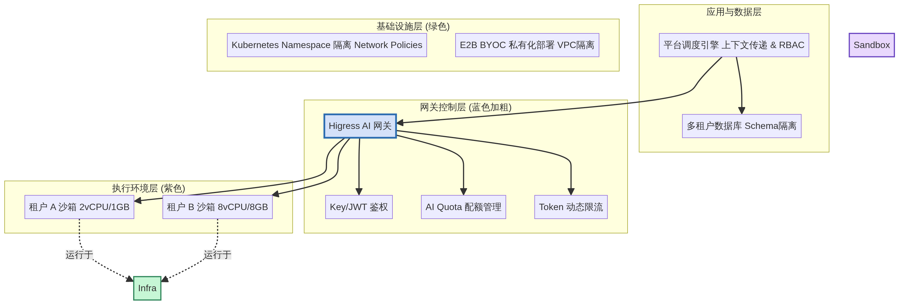

# 类 Manus 智能体平台：多租户隔离与资源配额管理设计方案

## 1. 引言

在构建企业级的大模型网关与类 Manus 智能体平台时，多租户架构是核心能力之一。为了确保不同企业客户（或内部不同业务部门）之间的数据安全、资源独享以及成本可控，平台必须提供强有力的隔离机制和配额管理方案。本文档在现有 Higress + OpenCode + E2B 架构的基础上，深入探讨如何实现全链路的多租户隔离与资源配额管理。

## 2. 多租户架构全景设计

为了实现真正的多租户隔离，我们需要在基础设施层、执行环境层、网关控制层以及应用层分别建立隔离边界。这种深度防御策略（Defense in Depth）确保了即使某一层出现配置疏漏，租户数据也不会发生越权访问。

| 架构层级 | 核心组件 | 隔离与配额机制 | 关键技术实现 |
| :--- | :--- | :--- | :--- |
| **应用与数据层** | 平台后端、数据库 | 逻辑隔离与数据分片 | 租户 ID 上下文传递、Schema-per-tenant 或 Row-level 隔离、RBAC 权限控制。 |
| **网关控制层** | Higress AI 网关 | 身份认证与 Token 限流 | 基于 API Key/JWT 的消费者鉴权、AI Quota 插件管理配额、基于租户的 Token 限流策略。 |
| **执行环境层** | OpenCode + E2B | 物理级沙箱隔离 | Firecracker microVM 强隔离、沙箱 Metadata 绑定租户、定制化 CPU/内存限制。 |
| **基础设施层** | E2B BYOC、Kubernetes | 网络与资源池隔离 | BYOC 私有化部署（VPC 隔离）、Kubernetes Namespace 隔离、Network Policies 限制跨租户通信。 |

## 3. 核心机制详解

### 3.1 网关层：基于 Higress 的身份鉴权与配额管理

Higress 作为流量调度的核心，承担着租户身份识别和资源消耗统计的重任。

*   **消费者鉴权（Consumer Authentication）**：Higress 支持通过 `key-auth` 或 `jwt-auth` 插件实现消费者（Consumer）鉴权。每个租户在网关层映射为一个或多个 Consumer。请求到达网关时，通过解析 API Key 或 JWT Token，系统能够精确识别请求所属的租户身份。
*   **Token 级配额管理（AI Quota Management）**：利用 Higress 的 `ai-quota` 插件，平台可以为每个租户（Consumer）分配固定的 Token 额度。该插件支持动态查询、刷新和增减配额，结合 `ai-statistics` 插件，实现对 LLM 调用的精确计费和成本控制。
*   **多维度动态限流（AI Token Rate Limiting）**：通过 `ai-token-ratelimit` 插件，平台可以实施基于 Token 消耗的速率限制。例如，可以配置“金牌租户”每分钟允许消耗 100,000 个 Token，而“免费租户”仅允许 10,000 个 Token。这种基于消费者的动态限流机制，有效防止了“吵闹的邻居（Noisy Neighbor）”效应，确保了服务公平性。

### 3.2 执行层：基于 E2B 的强隔离与资源分配

E2B 沙箱是 AI Agent 执行代码和工具的场所，其隔离性直接关系到平台的安全性。

*   **MicroVM 级别的强隔离**：E2B 采用 Firecracker 技术，为每次 Agent 执行提供独立的微虚拟机（microVM）。与传统的容器（如 Docker）共享宿主机内核不同，Firecracker 提供了硬件级别的安全隔离，彻底杜绝了恶意代码逃逸或跨租户窥探的风险。
*   **定制化计算资源配置**：E2B 支持在创建沙箱模板时，通过 `cpuCount` 和 `memoryMB` 参数自定义分配给沙箱的计算资源。平台可以根据租户的订阅等级，为其分配不同规格的沙箱（例如，基础版 2 vCPU/1GB RAM，专业版 8 vCPU/8GB RAM），实现计算资源的精细化管理。
*   **Metadata 与生命周期管理**：在创建 E2B 沙箱时，可以通过注入 Metadata（如 `tenant_id`、`session_id`）将沙箱与特定租户强绑定。这不仅便于后续的计费统计，也能确保沙箱在暂停、恢复或销毁时的生命周期管理严格遵循租户边界。

### 3.3 基础设施层：BYOC 与 Kubernetes 隔离

对于对数据隐私有极高要求的企业客户，平台需要提供更深层次的隔离方案。

*   **Bring Your Own Cloud (BYOC) 部署**：E2B 提供了 BYOC 模式，允许将沙箱集群直接部署在客户自己的云环境（如 AWS VPC）中。在这种模式下，沙箱的运行日志、模板数据和网络流量完全保留在客户的私有网络内，实现了最高级别的数据主权和网络隔离。
*   **Kubernetes 命名空间与网络策略**：在平台自身的控制面部署中，应采用 Kubernetes Namespace 隔离不同租户的管控组件。结合 Resource Quotas 和 LimitRanges 限制每个命名空间的资源上限，并利用 Network Policies 实施“默认拒绝（Default Deny）”策略，仅允许同一命名空间内的 Pod 互相通信，切断跨租户的网络连接。

### 3.4 数据层：租户上下文传递与 RBAC

在多租户系统中，数据访问的安全性至关重要。

*   **租户上下文传播（Tenant Context Propagation）**：从用户发起请求开始，租户 ID 必须作为核心上下文（Context）在整个系统中传递。无论是 Higress 网关的路由、OpenCode 的任务编排，还是最终的数据库访问，都必须携带并校验该上下文。
*   **数据隔离模式**：推荐采用 Schema-per-tenant 或基于 Row-level Security (RLS) 的隔离模式。每个租户的数据在逻辑上或物理上完全分开，防止由于代码缺陷导致的数据越权访问。
*   **角色与权限控制（RBAC）**：在租户内部，实施细粒度的基于角色的访问控制（RBAC）。确保 AI Agent 仅被授予完成任务所需的最小权限（Principle of Least Privilege），防止权限提升攻击。

## 4. 结论

通过在 Higress 网关层实施基于 Token 的身份鉴权与动态限流，在 E2B 执行层采用 Firecracker 强隔离与定制化资源分配，并在基础设施和数据层辅以 BYOC、网络策略及严格的上下文传递机制，我们能够构建出一个高度安全、资源可控且支持弹性扩展的多租户类 Manus 智能体平台。这一综合方案不仅满足了企业级客户对数据隐私和合规性的严苛要求，也为平台的长期商业化运营奠定了坚实的技术基础。

## 附录：多租户隔离架构图

