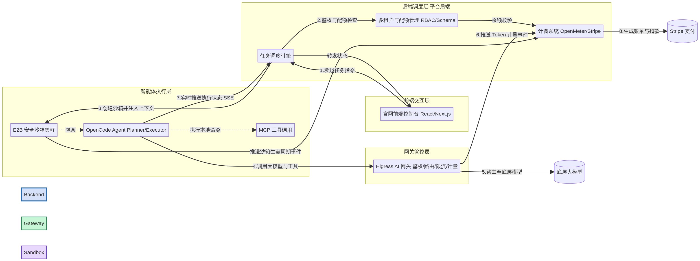

# 类 Manus 智能体平台：模块功能详细说明与串联关系

## 1. 引言

本文档基于前期对 Higress、OpenCode、E2B 的架构调研，以及多租户隔离、计费系统集成方案和 2 个月开发计划，详细阐述平台各核心模块的功能定位、具体实现方式（要做什么、如何做），以及这些模块之间如何协同工作，共同支撑起一个具备企业级调度能力的智能体平台。同时，文档详细列出了各模块所依赖的核心开源项目及其用途。关于进一步的服务拆分、状态机、事件账本、权限边界和潜在问题，可结合 `07_技术实现细化与潜在问题清单.md` 一并阅读。

## 2. 大模型网关模块 (Higress)

大模型网关是平台的“流量中枢”与“能力集成中心”，负责处理所有进出的大模型请求及工具调用路由。

### 2.1 模块功能与要做什么
*   **多模型路由与负载均衡**：统一对接 OpenAI、Anthropic、Alibaba 等多种大模型 API，屏蔽底层差异，提供标准化的访问入口，并实现智能路由和 Fallback 机制。
*   **身份鉴权与消费者管理**：为平台上的每个租户（或应用）生成独立的 API Key 或 JWT Token，并在请求到达时进行身份验证。
*   **流量控制与资源配额**：基于租户的订阅等级，实施精确到 Token 级别的动态限流，防止个别租户耗尽系统资源。
*   **可观测性与计量数据采集**：实时采集每次 LLM 调用的 Input/Output Token 消耗、延迟等指标，为计费系统提供基础数据。

### 2.2 如何做（技术实现）
*   **基础部署**：使用 Kubernetes 部署 Higress 集群，配置为系统的统一 Ingress 入口。
*   **鉴权实现**：启用 `key-auth` 和 `jwt-auth` 插件。后端系统在创建租户时，调用 Higress 控制面 API 动态下发 Consumer 配置及对应的鉴权凭证。
*   **配额与限流**：集成 `ai-quota` 插件管理租户总额度，集成 `ai-token-ratelimit` 插件控制 QPS 和 TPS（Tokens Per Second）。
*   **指标采集**：启用 `ai-statistics` 插件。配置日志格式和 Trace 属性，将请求中的 `consumer`（租户 ID）、`model`、`input_token` 等信息提取为 CloudEvents 格式，并通过 Webhook 或日志收集器发送至 Kafka。

### 2.3 核心开源项目依赖
| 项目名称 | 用途 | 许可证 | GitHub 仓库 |
| :--- | :--- | :--- | :--- |
| **Higress** | 核心 AI 网关，负责流量路由、鉴权、限流与计量插件运行。 | Apache-2.0 | [alibaba/higress](https://github.com/alibaba/higress) |

## 3. 智能体平台模块 (OpenCode + E2B)

智能体平台模块是系统的“执行引擎”，负责将自然语言指令转化为具体的动作，并在安全环境中执行。

### 3.1 模块功能与要做什么
*   **任务拆解与智能编排**：接收用户的复杂指令，通过内部的 Planner Agent 将其拆解为可执行的子任务。
*   **安全沙箱调度**：为每个任务分配独立的执行环境，确保代码运行和系统操作的安全隔离。
*   **工具调用与 MCP 集成**：Agent 在执行过程中，能够通过标准化的 MCP 协议调用外部工具（如数据库查询、API 访问）或执行本地脚本。
*   **状态同步与流式输出**：将 Agent 的思考过程、终端输出、文件变更等状态实时推送给前端，提供流畅的用户体验。

### 3.2 如何做（技术实现）
*   **Agent 运行时集成**：引入 OpenCode 作为核心 Agent 框架。定制其 Primary Agent（规划者）和 Subagents（执行者）的协同逻辑，使其适应平台的特定业务场景。
*   **沙箱调度封装**：后端服务通过 E2B SDK，在接收到任务时动态创建 Firecracker microVM 沙箱。将 OpenCode 运行时注入沙箱，并通过环境变量传递任务上下文和鉴权 Token。
*   **MCP 协议接入**：在沙箱内配置 MCP 客户端。Agent 需要调用外部企业能力时，通过 MCP 协议向 Higress 网关发起请求，由网关路由至相应的企业内部 MCP Server。
*   **异步执行与推送**：采用 FastAPI + Celery（或 Redis Queue）构建异步任务队列。OpenCode 在沙箱内通过 HTTP/SSE 或 WebSocket 将执行日志实时推送回后端，后端再通过 SSE 转发给前端 Web 控制台。

### 3.3 核心开源项目依赖
| 项目名称 | 用途 | 许可证 | GitHub 仓库 |
| :--- | :--- | :--- | :--- |
| **OpenCode** | 终端与环境驱动的开源 AI 编码 Agent 框架，负责任务规划与执行。 | MIT | [opencode-ai/opencode](https://github.com/opencode-ai/opencode) |
| **E2B** | 提供安全、持久化的云端 Agent 执行沙箱及 SDK。 | Apache-2.0 | [e2b-dev/e2b](https://github.com/e2b-dev/e2b) |
| **Firecracker** | E2B 底层依赖的微虚拟机技术，提供硬件级强隔离。 | Apache-2.0 | [firecracker-microvm/firecracker](https://github.com/firecracker-microvm/firecracker) |
| **FastAPI** | 构建平台后端异步调度引擎与 API 接口。 | MIT | [fastapi/fastapi](https://github.com/fastapi/fastapi) |
| **Celery** | 分布式任务队列，用于异步调度 Agent 任务。 | BSD-3-Clause | [celery/celery](https://github.com/celery/celery) |

## 4. 多租户与配额模块

该模块负责在逻辑层和物理层实现租户间的严格隔离，保障数据安全。

### 4.1 模块功能与要做什么
*   **租户身份管理**：维护租户信息、组织架构及用户角色（RBAC）。
*   **上下文传递**：确保在整个分布式调用链路中，租户 ID 始终被正确传递和校验。
*   **数据隔离**：保证各租户在数据库层面的数据互不可见。

### 4.2 如何做（技术实现）
*   **RBAC 与上下文**：在后端实现中间件，从请求 Header 或 JWT 中提取租户 ID，并注入到当前请求的 Context 中。
*   **数据库隔离**：采用 Schema-per-tenant 模式。在 PostgreSQL 中为每个租户创建独立的 Schema，ORM 层根据 Context 中的租户 ID 动态切换 Schema。
*   **沙箱隔离**：调用 E2B API 创建沙箱时，在 Metadata 中注入 `tenant_id`。E2B 的 Firecracker 底层机制天然保证了不同沙箱（即不同租户）间的物理级内存和 CPU 隔离。

### 4.3 核心开源项目依赖
| 项目名称 | 用途 | 许可证 | GitHub 仓库 |
| :--- | :--- | :--- | :--- |
| **PostgreSQL** | 关系型数据库，利用 Schema 特性实现多租户数据逻辑隔离。 | PostgreSQL | [postgres/postgres](https://github.com/postgres/postgres) |

## 5. 计费系统模块

负责将系统的资源消耗转化为商业账单。

### 5.1 模块功能与要做什么
*   **事件摄取与聚合**：高吞吐量接收来自网关和沙箱的计量事件。
*   **实时余额计算**：维护租户的预付费积分余额，支持实时扣减。
*   **账单生成与支付**：根据阶梯定价策略生成周期性账单，并处理信用卡扣款。

### 5.2 如何做（技术实现）
*   **计量管道**：部署 OpenMeter。配置 Kafka 接收 Higress 的 Token 消耗事件和 E2B 的沙箱时长事件（Webhook）。OpenMeter 利用 ClickHouse 进行实时聚合计算。
*   **支付集成**：后端服务集成 Stripe API。在 Stripe 中配置产品和价格表（Rate Cards）。每月初，后端从 OpenMeter 拉取上月汇总数据，调用 Stripe API 生成 Invoice 并自动扣款。
*   **余额告警**：后端定时轮询（或通过 OpenMeter 的 Threshold Webhook）检查租户积分。当积分低于阈值时，触发邮件通知；耗尽时，调用 Higress API 动态将该租户的配额设为 0，实现秒级停服。

### 5.3 核心开源项目依赖
| 项目名称 | 用途 | 许可证 | GitHub 仓库 |
| :--- | :--- | :--- | :--- |
| **OpenMeter** | 实时使用量计量引擎，负责接收和聚合 Token 与时长消耗事件。 | Apache-2.0 | [openmeterio/openmeter](https://github.com/openmeterio/openmeter) |
| **Apache Kafka** | 高吞吐量消息队列，用于缓冲 Higress 产生的海量计量事件。 | Apache-2.0 | [apache/kafka](https://github.com/apache/kafka) |
| **ClickHouse** | 实时分析型列式数据库，OpenMeter 的底层存储与计算引擎。 | Apache-2.0 | [ClickHouse/ClickHouse](https://github.com/ClickHouse/ClickHouse) |

## 6. 官网与前端模块

为用户提供直观的交互界面和管理控制台。

### 6.1 模块功能与要做什么
*   **门户展示**：产品介绍、定价方案及注册登录入口。
*   **租户控制台**：展示资源用量统计、账单详情及配额管理界面。
*   **Agent 交互界面**：类似 Manus 的聊天窗口，支持实时流式输出、终端画面展示及任务历史回溯。

### 6.2 如何做（技术实现）
*   **技术栈**：采用 React + Next.js + TailwindCSS 构建响应式界面。
*   **数据交互**：通过 RESTful API 与后端进行常规数据交互（如账单查询）。对于 Agent 任务执行，采用 Server-Sent Events (SSE) 接收实时流式日志和状态更新。

### 6.3 核心开源项目依赖
| 项目名称 | 用途 | 许可证 | GitHub 仓库 |
| :--- | :--- | :--- | :--- |
| **Next.js** | React 框架，用于构建官网与前端控制台，支持 SSR 与优化。 | MIT | [vercel/next.js](https://github.com/vercel/next.js) |
| **Tailwind CSS** | 实用优先的 CSS 框架，用于快速构建现代化 UI。 | MIT | [tailwindlabs/tailwindcss](https://github.com/tailwindlabs/tailwindcss) |

## 7. 测试与运维模块

确保系统的高质量交付与稳定运行。

### 7.1 核心开源项目依赖
| 项目名称 | 用途 | 许可证 | GitHub 仓库 |
| :--- | :--- | :--- | :--- |
| **Kubernetes** | 容器编排平台，负责管理 Higress、后端引擎、OpenMeter 等组件。 | Apache-2.0 | [kubernetes/kubernetes](https://github.com/kubernetes/kubernetes) |
| **Helm** | Kubernetes 包管理器，用于打包和部署系统各组件。 | Apache-2.0 | [helm/helm](https://github.com/helm/helm) |
| **Prometheus** | 监控系统，收集各组件及物理节点的运行指标。 | Apache-2.0 | [prometheus/prometheus](https://github.com/prometheus/prometheus) |
| **Grafana** | 可视化平台，用于展示监控指标大盘。 | AGPL-3.0 | [grafana/grafana](https://github.com/grafana/grafana) |
| **k6** | 负载测试工具，用于全链路压力测试，模拟高并发任务调度。 | AGPL-3.0 | [grafana/k6](https://github.com/grafana/k6) |
| **ZAP** | OWASP Zed Attack Proxy，用于多租户隔离与 Web 安全渗透测试。 | Apache-2.0 | [zaproxy/zaproxy](https://github.com/zaproxy/zaproxy) |

## 8. 模块间串联关系与整体数据流转

上述各模块并非孤立存在，它们通过紧密的接口和事件机制串联成一个完整的闭环系统。以下是核心任务执行的数据流转过程：

1.  **任务发起**：用户在**官网前端 (Next.js)** 输入自然语言指令。前端将请求（携带 JWT Token）发送至**平台后端 (FastAPI)**。
2.  **鉴权与配额检查**：**平台后端**解析 Token 识别**多租户**身份，查询**计费系统 (OpenMeter)** 确认该租户余额充足，并在数据库 (PostgreSQL) 中创建任务记录。
3.  **环境准备**：**平台后端**调用 **E2B API**，拉起一个绑定了该租户 Metadata 的安全沙箱 (Firecracker)。
4.  **任务下发**：后端将任务指令及环境上下文发送给沙箱内的 **OpenCode Agent**。
5.  **大模型与工具调用**：OpenCode 在规划和执行过程中，所有的大模型请求和 MCP 工具调用均发送至 **Higress 网关**。
6.  **网关路由与计量**：Higress 校验请求，执行路由和限流。同时，`ai-statistics` 插件生成 Token 消耗事件，推送到 **Kafka**，由 **OpenMeter (ClickHouse)** 实时聚合。
7.  **实时反馈**：OpenCode 将执行日志（如思考过程、终端输出）实时推送给后端，后端通过 SSE 转发给**前端**展示。
8.  **任务结束与结算**：任务完成后，后端销毁 E2B 沙箱。E2B 触发销毁 Webhook，后端计算沙箱运行时长，发送计量事件至 OpenMeter。**计费系统**汇总 Token 和时长费用，更新租户账单。

通过这种“前端交互 -> 后端调度 -> 沙箱执行 -> 网关管控 -> 实时计量”的串联机制，系统实现了智能化调度与企业级管控的完美结合。

## 附录：模块串联架构图

